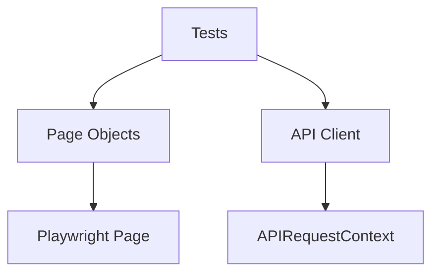
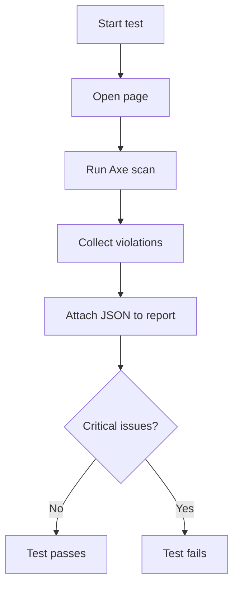
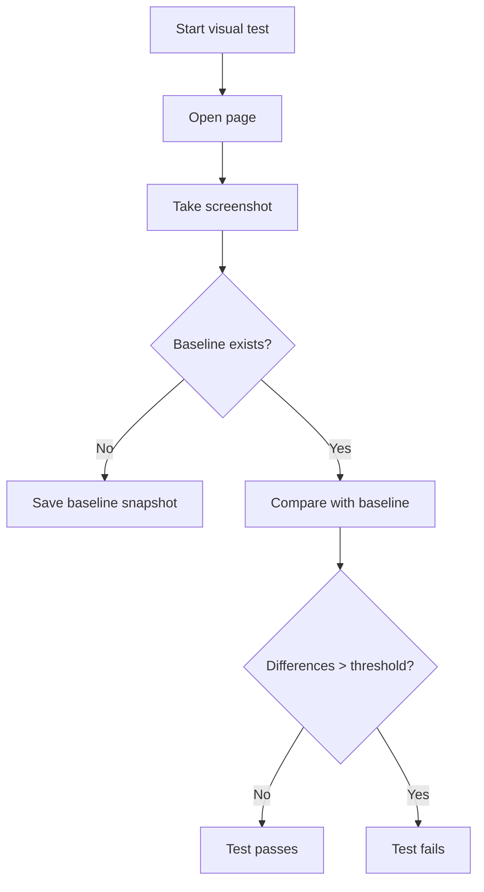
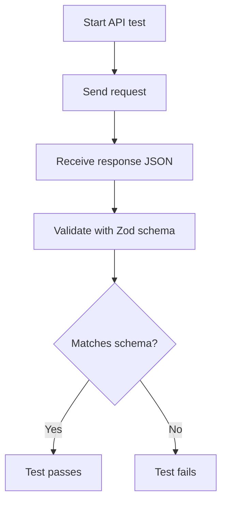
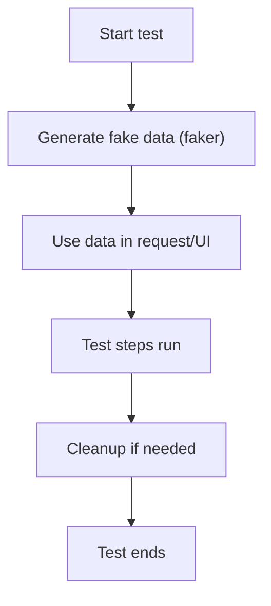
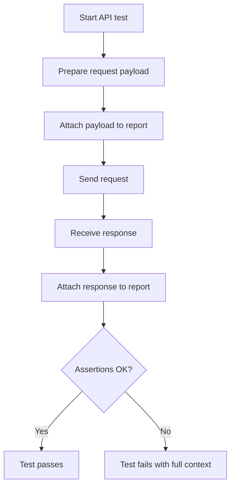
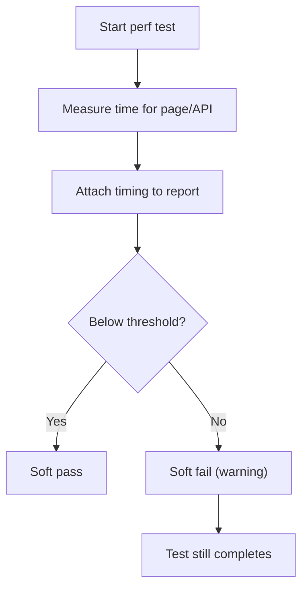

# Playwright Portfolio

A comprehensive Playwright portfolio built on public demo sites. The goal is to showcase key techniques: UI/E2E, API, stable selectors, fixtures, test data, reporting, and artifacts.

## What we test

- UI/E2E: `https://the-internet.herokuapp.com` (UI edge cases)
- UI/E2E: `https://automationexercise.com` (e-commerce flows)
- API: `https://restful-booker.herokuapp.com` (CRUD + auth)

## Structure

- `playwright.config.ts` - test configuration, browser projects, reporters
- `tests/ui/` - UI scenarios
- `tests/api/` - API scenarios
- `tests/a11y/` - accessibility checks (axe)
- `tests/visual/` - visual regression specs
- `tests/perf/` - performance smoke tests
- `tests/auth/` - authenticated-state tests
- `tests/ui/**/home.network-mock.spec.ts` - network mocking example
- `tests/pages/` - Page Objects
- `tests/fixtures/` - custom fixtures (service URLs)
- `tests/utils/` - helpers for API and UI stability
- `tests/utils/a11y.ts` - axe helper and reporting
- `tests/utils/restful-booker.schemas.ts` - API contract schemas
- `tests/data/` - test data and upload files
- `tests/data/factories/` - data factories (faker)

## Architecture

## Test flow diagrams

Accessibility (a11y):

Visual regression:

API contract:

Test data factory:

Traceability (attachments):

Performance smoke:

## Quick start

1. Install dependencies:
   - `npm install`
2. Install browsers:
   - `npx playwright install`
3. Run tests:
   - `npm test`

## Useful commands

- `npm run test:ui` - UI mode
- `npm run test:headed` - headed mode
- `npm run test:debug` - debug
- `npm run report` - open HTML report
- `npm run test:smoke` - run smoke tests (by tag)
- `npm run test:ui:tag` - run UI tests (by tag)
- `npm run test:api` - run API tests (by tag)
- `npm run test:a11y` - run a11y checks (by tag)
- `npm run test:perf` - run performance smoke tests (by tag)
- `npm run test:mock` - run network-mock tests (by tag)
- `npm run test:auth` - run auth-state tests (authenticated project, runs auth setup)
- `npm run test:visual` - run visual regression (visual project)
- `npm run test:visual:update` - update visual baselines
- `npm run lint` - lint the codebase
- `npm run format` - format the codebase
- `npm run clean` - remove generated test artifacts and auth state
- `npx playwright test tests/a11y` - run a11y checks
- `npx playwright test --project=visual` - run visual regression
- `npx playwright test --project=visual --update-snapshots` - update visual baselines
- `npx playwright test tests/perf` - run performance smoke tests

## macOS (arm64)

On macOS 15 (arm64) Playwright can be detected as `mac15` (x64) and then look for the wrong binaries. In `playwright.config.ts` we automatically set `PLAYWRIGHT_HOST_PLATFORM` based on the Darwin version, so a plain:

- `npm test`

is enough.

## Stability on demo sites

`automationexercise.com` can display cookie consent and ads that cover elements in mobile tests. Helpers in `tests/utils/automation-exercise.ts` (`dismissCookieConsent`, `dismissAds`) remove overlays and ads.

## Quality gates

Linting and formatting are enforced via ESLint + Prettier. A Husky pre-commit hook runs `lint-staged` to keep changes clean before commit.

## Artifacts cleanup

Generated runtime artifacts are stored in `playwright-report/`, `test-results/`, `artifacts/`, and `tests/.auth/`.
Use `npm run clean` to remove them before committing or sharing the repository.

## Test types

- Accessibility: Axe scans run in `tests/a11y/` and attach violations to the report.
- Visual regression: `tests/visual/` uses `toHaveScreenshot` with a dedicated `visual` project.
- API contract: `zod` schemas validate API responses in `tests/utils/restful-booker.schemas.ts`.
- Test data: `@faker-js/faker` data factories live in `tests/data/factories/`.
- Traceability: API tests attach payloads and responses to the report for fast debugging.
- Performance smoke: lightweight timing checks live in `tests/perf/`.
- Auth state: `tests/global-setup.ts` creates a storage state for authenticated tests in `tests/auth/`.
- Network mocking: `tests/ui/automation-exercise/home.network-mock.spec.ts` is a mock demo that uses `page.route` to stub an API response and injects it into the UI for deterministic checks (the demo site does not call this API on its own).

## Highlights

- Stable locators (`getByRole`, `getByLabel`, `getByPlaceholder`)
- Page Object Model structure for all UI tests
- `test.step` for clean logs
- API CRUD with separate JSON payloads
- Artifacts: trace, screenshot, and video on failure

## Design decisions

- UI tests use Page Objects to keep selectors and flows centralized.
- API tests use a small client class plus Zod schemas for contract checks.
- Performance tests use soft assertions to avoid unnecessary flakiness.
- Tagging (`@smoke`, `@ui`, `@api`, `@a11y`, `@perf`, `@visual`, `@auth`, `@mock`) keeps large suites easy to slice.

## Notes

Demo sites can change over time. If a test becomes flaky, it usually only needs a more stable selector or a small wait adjustment (for example around hovers or overlays).

## Author

Miłosz Sobiecki
